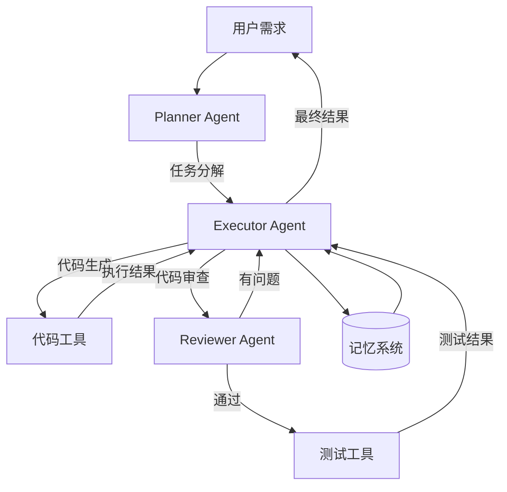

本文整理了 Agent 方向的高频面试问题，帮助读者系统性地准备相关面试。

## 基础概念

### Q1: 什么是 AI Agent？它与传统的 LLM 调用有什么区别？

AI Agent 是以 LLM 为核心推理引擎，具备自主感知、决策和行动能力的智能系统。与传统 LLM 调用的区别在于：

- 传统 LLM 调用是**单轮或简单多轮对话**，模型只能生成文本；
- Agent 具备**工具调用**能力，可以与外部环境交互；
- Agent 具备**规划能力**，可以将复杂任务分解为子步骤；
- Agent 具备**记忆能力**，可以跨步骤、跨会话保持上下文；
- Agent 具备**反思能力**，可以根据反馈调整策略。

### Q2: 请解释 ReAct 框架的工作原理。

ReAct（Reasoning + Acting）是一种将推理与行动交替进行的 Agent 范式。其工作流程为：

1. **Thought**：模型分析当前状态，推理下一步行动；
2. **Action**：根据推理结果选择并执行一个动作；
3. **Observation**：获取动作执行的结果；
4. 循环执行，直到得出最终答案。

核心优势是**可解释性**和**灵活性**——Thought 步骤使决策过程透明，Observation 使模型可以动态调整策略。

### Q3: Function Calling 是如何工作的？模型是如何学会调用工具的？

**工作流程**：

1. 开发者在请求中定义可用工具的名称、描述和参数 schema；
2. 模型根据用户需求推理出需要调用的工具，生成结构化的调用请求（JSON 格式）；
3. 客户端执行工具调用，将结果返回给模型；
4. 模型基于工具结果生成最终回复。

**训练方式**：

- **SFT 阶段**：在训练数据中加入大量「需求 → 工具调用」的样本对；
- **RL 阶段**：通过强化学习优化工具选择的准确性和参数生成的质量。

## 核心技术

### Q4: Agent 的记忆机制有哪些类型？如何设计一个长期记忆系统？

Agent 的记忆分为三类：

- **短期记忆**：对应 LLM 的上下文窗口，任务结束即丢失；
- **长期记忆**：通过向量数据库、知识图谱或文件系统持久化存储；
- **工作记忆**：当前任务的临时状态和中间结果。

设计长期记忆系统的关键考虑：

1. **存储方式**：通常使用向量数据库（如 Chroma、FAISS）进行 embedding 存储；
2. **检索策略**：语义检索（向量相似度）+ 关键词检索的混合方案；
3. **写入策略**：根据重要性评分选择性写入，避免存储噪声；
4. **遗忘策略**：基于时间衰减、容量限制或相关性淘汰低优先级信息。

### Q5: 单次规划（Plan-and-Execute）和自适应规划（Re-planning）各有什么优缺点？

**单次规划**：

- 优点：全局视角，步骤之间逻辑连贯，执行效率高；
- 缺点：初始计划可能因信息不足而不准确，执行过程中难以修正。

**自适应规划**：

- 优点：容错性强，能根据中间结果动态调整策略；
- 缺点：开销更大，频繁重新规划可能导致循环或资源浪费。

实际应用中，通常采用折中方案：先生成一个粗粒度的初始计划，在执行过程中进行**有限次数**的重新规划。

### Q6: 请对比 MCP 和 Function Calling。

| 维度 | Function Calling | MCP |
|---|---|---|
| 本质 | 模型的输出能力 | 工具交互的通信协议 |
| 工具发现 | 静态定义在请求中 | 动态发现（tools/list） |
| 跨模型 | 各厂商格式不同 | 统一开放标准 |
| 运行时 | 不支持动态更新 | 支持工具动态注册 |
| 复杂度 | 简单直接 | 需要 Server-Client 架构 |

两者是**互补关系**而非替代关系：MCP Server 的工具最终通常还是通过 Function Calling 被模型调用。

## 工程实践

### Q7: 如何评估一个 Agent 系统的质量？

Agent 评估通常从以下几个维度展开：

- **任务完成率**：Agent 是否成功完成了目标任务；
- **步骤效率**：完成任务所需的步骤数和工具调用次数；
- **准确性**：中间结果和最终输出的正确性；
- **鲁棒性**：面对错误和异常时的恢复能力；
- **延迟与成本**：端到端响应时间和 token 消耗。

常用 Benchmark：

- **SWE-bench**：代码修复能力评估；
- **WebArena**：Web 浏览与操作能力评估；
- **GAIA**：通用 AI 助手能力评估；
- **ToolBench**：工具调用能力评估。

### Q8: 在实际项目中，如何减少 Agent 的幻觉问题？

1. **工具增强**：让 Agent 通过工具获取真实数据，而非依赖模型内部知识；
2. **检索增强**：通过 RAG 提供准确的上下文信息；
3. **事实校验**：在关键步骤后增加事实验证环节；
4. **置信度评估**：让模型对自己的输出给出置信度，低置信度时触发重试或请求人工干预；
5. **约束输出**：通过 Structured Output 限制模型的输出格式，减少自由发挥的空间。

### Q9: 多 Agent 系统中，如何处理 Agent 之间的冲突？

- **优先级机制**：为不同 Agent 设置优先级，高优先级 Agent 的决策优先执行；
- **投票机制**：多个 Agent 各自给出方案，通过投票或加权投票决定最终方案；
- **仲裁者**：引入专门的仲裁 Agent，负责裁决不同 Agent 的冲突；
- **辩论机制**：让冲突的 Agent 进行多轮辩论，通过推理达成共识；
- **回退机制**：无法达成一致时，回退到更保守的默认方案。

### Q10: 请设计一个代码 Agent 的整体架构。

核心组件：

1. **Planner Agent**：负责理解需求、分解任务、制定执行计划；
2. **Executor Agent**：负责代码生成、文件操作、命令执行等具体操作；
3. **Reviewer Agent**：负责代码审查、质量检查、错误检测；
4. **记忆系统**：存储项目上下文、历史操作、错误经验等；
5. **工具层**：文件读写、终端执行、搜索、版本控制等。

关键设计考虑：

- 使用 ReAct 范式进行推理与执行的交替；
- 每次操作后检查结果，失败时进行反思和重试；
- 通过代码测试验证生成代码的正确性。
