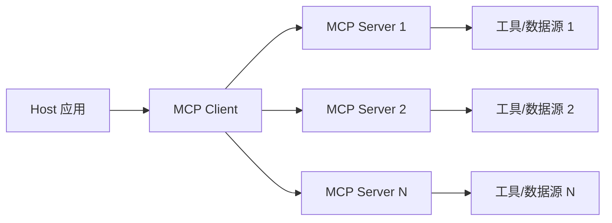
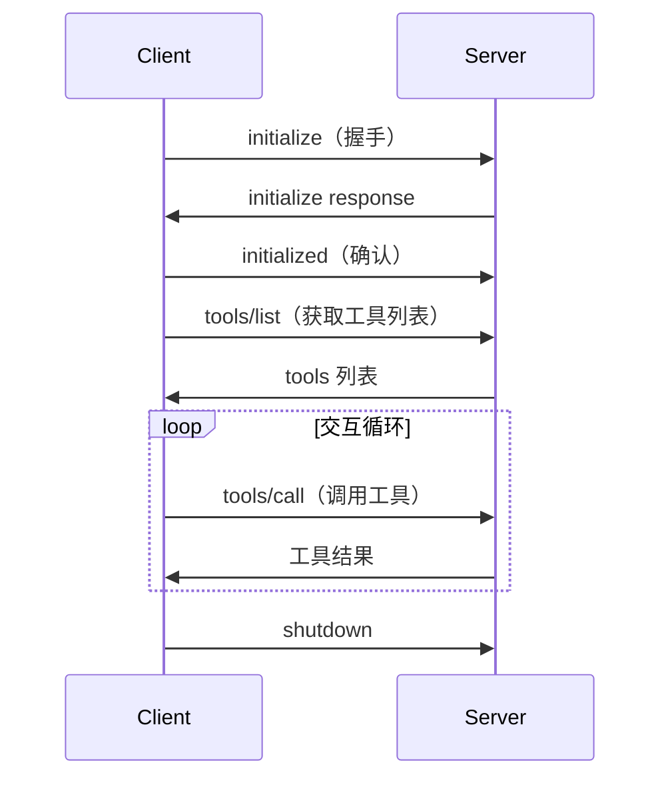

> [!quote]
>
> MCP is an open protocol that standardizes how applications provide context to LLMs — like a USB-C port for AI.

## 基本概念

Model Context Protocol (MCP) 是 Anthropic 于 2024 年推出的开放协议，旨在标准化大模型与外部工具、数据源之间的交互方式。

类比来说：如果 LLM 是电脑，工具是外设，那么 MCP 就是 USB 接口标准——任何符合 MCP 标准的工具都可以被任何支持 MCP 的 AI 应用使用。

## 架构

MCP 采用 Client-Server 架构：

核心组件：

- **Host**：AI 应用本身（如 Claude Desktop、Cursor 等）；
- **MCP Client**：在 Host 内部运行，负责与 MCP Server 通信；
- **MCP Server**：暴露具体的工具和数据源。

## 核心能力

MCP Server 可以向 LLM 暴露三种类型的能力：

### Tools（工具）

可以被 LLM 调用的函数，例如查询数据库、发送邮件、操作文件系统等。这与 Function Calling 概念类似，但 MCP 提供了标准化的发现和调用机制。

### Resources（资源）

可以被 LLM 读取的数据，类似于 GET 请求。例如读取文件内容、获取数据库查询结果等。

### Prompts（提示词模板）

预定义的提示词模板，由用户在交互中选择使用。

## 协议细节

MCP 基于 JSON-RPC 2.0 协议进行通信，支持两种传输方式：

- **stdio**：通过标准输入输出通信，适合本地 Server；
- **Streamable HTTP**：基于 HTTP 的远程通信，适合云端 Server。

### 生命周期

## 与 Function Calling 的关系

| 维度 | Function Calling | MCP |
|---|---|---|
| 定义方 | 各模型厂商 | 开放标准 |
| 工具发现 | 静态定义在请求中 | 动态发现（tools/list） |
| 工具执行 | 客户端自行处理 | Server 端处理 |
| 跨模型兼容 | ❌ 各厂商格式不同 | ✅ 统一协议 |
| 运行时更新 | ❌ 需重新发起请求 | ✅ 支持动态注册 |

## 生态

- [MCP 官方规范](https://modelcontextprotocol.io/)
- [Awesome MCP Servers](https://github.com/punkpeye/awesome-mcp-servers)
- 主流 MCP Server：文件系统、GitHub、Slack、数据库、搜索引擎等。
