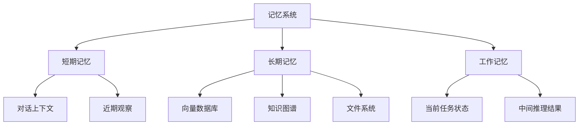
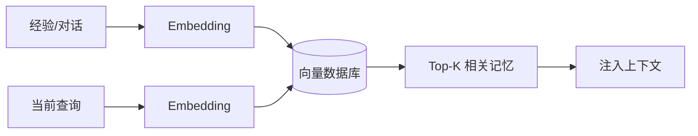

> [!quote]
>
> Memory is the skeleton of identity — without it, agents are Stateless tools.

## 基本概念

记忆 (Memory) 是 Agent 维持上下文连贯性和积累经验的基础能力。与人类记忆类似，Agent 的记忆机制通常可以分为以下几类：

## 短期记忆

短期记忆 (Short-term Memory) 对应 LLM 的**上下文窗口** (Context Window)，即当前对话或任务中模型能直接访问的信息。

特点：

- 容量有限，受模型最大上下文长度限制；
- 访问速度极快，直接参与推理；
- 任务结束后即丢失。

优化手段：

- **上下文压缩**：使用摘要模型或选择性保留关键信息；
- **滑动窗口**：只保留最近 N 轮对话；
- **重要性筛选**：根据相关性对历史信息排序，只保留高分内容。

## 长期记忆

长期记忆 (Long-term Memory) 用于存储跨会话、跨任务的持久化信息。

### 基于向量数据库

最常见的方式是将信息 embedding 后存入向量数据库（如 Chroma、FAISS、Milvus），在需要时通过语义检索召回相关记忆。

### 基于知识图谱

将提取的实体和关系存储在知识图谱中，适合需要结构化推理的场景。

### 基于文件系统

Agent 将重要信息直接写入文件（如笔记、日志），在需要时读取。这种方式简单直接，常见于代码 Agent 中。

## 工作记忆

工作记忆 (Working Memory) 是 Agent 在执行当前任务时的临时存储，包括：

- 当前任务的目标和约束；
- 中间推理结果；
- 已尝试但失败的方案（用于避免重复错误）。

工作记忆通常通过 System Prompt 或特殊的记忆变量来管理。

## 记忆管理策略

### 写入策略

- **即时写入**：每次观察后立即存储；
- **批量写入**：定期汇总后批量存储；
- **选择性写入**：根据重要性评分决定是否存储。

### 检索策略

- **语义检索**：基于向量相似度检索；
- **关键词检索**：基于关键词匹配；
- **混合检索**：结合语义和关键词检索；
- **时间衰减**：近期记忆权重更高。

### 遗忘策略

- **基于时间**：过期信息自动降权或删除；
- **基于容量**：存储空间不足时淘汰低优先级信息；
- **基于相关性**：与当前任务无关的信息被逐步淘汰。

## 记忆与幻觉

记忆机制的质量直接影响 Agent 的幻觉率：

- 检索到不相关的信息会**误导**模型；
- 记忆中的错误信息会被模型当作事实**放大**；
- 需要对检索到的记忆进行**验证和过滤**。
