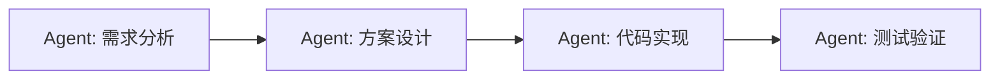
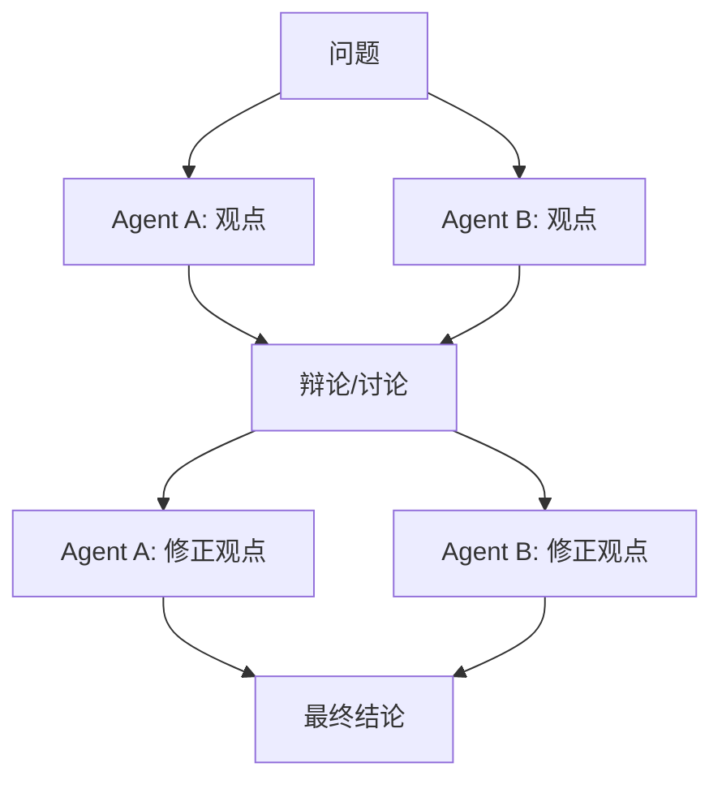
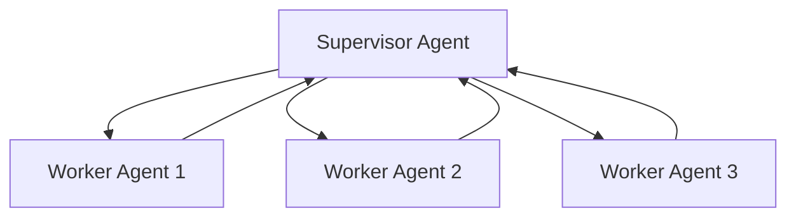
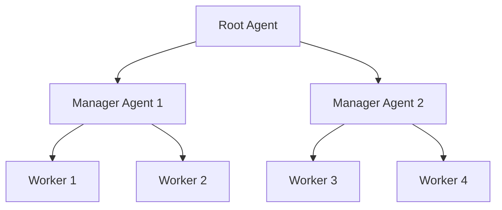

> [!quote]
>
> The whole is greater than the sum of its parts.

## 基本概念

多智能体系统 (Multi-Agent System, MAS) 是指多个 Agent 协作完成任务的架构。相较于单个 Agent，多智能体系统通过**分工**和**协作**来处理更复杂的任务。

核心思想：不同的 Agent 承担不同的角色（如规划者、执行者、评审者），通过消息传递进行协作，最终汇聚结果。

## 协作模式

### 管道模式 (Pipeline)

Agent 按照固定的顺序依次处理任务，前一个 Agent 的输出是后一个 Agent 的输入。

### 辩论模式 (Debate)

多个 Agent 就同一问题进行多轮辩论，最终达成共识。

### 监督模式 (Supervisor)

一个主 Agent 负责分配任务和监督执行，子 Agent 专注执行具体任务并向主 Agent 汇报。

### 层级模式 (Hierarchical)

Agent 按照层级组织，上层 Agent 负责分解任务并分配给下层 Agent，下层 Agent 进一步分解或直接执行。

## 经典系统

### AutoGen (Microsoft)

微软开源的多智能体框架，支持灵活的 Agent 对话模式，核心特性：

- 可定制的 Agent 角色；
- 支持人机协作 (Human-in-the-loop)；
- 支持代码执行和工具调用。

### CrewAI

基于角色的多智能体框架，每个 Agent 有明确的 role、goal 和 backstory，模拟真实团队协作。

### ChatDev

模拟软件公司组织架构，将软件开发过程拆分为多个 Agent 角色（CEO、CTO、程序员、测试等）的协作。

## 关键挑战

- **通信开销**：Agent 之间的消息传递增加延迟和 token 消耗；
- **协调复杂度**：Agent 数量增多时，协作策略的设计难度急剧上升；
- **一致性问题**：不同 Agent 可能产生矛盾的输出，需要仲裁机制；
- **调试困难**：多 Agent 系统的错误追踪和定位更加复杂。

