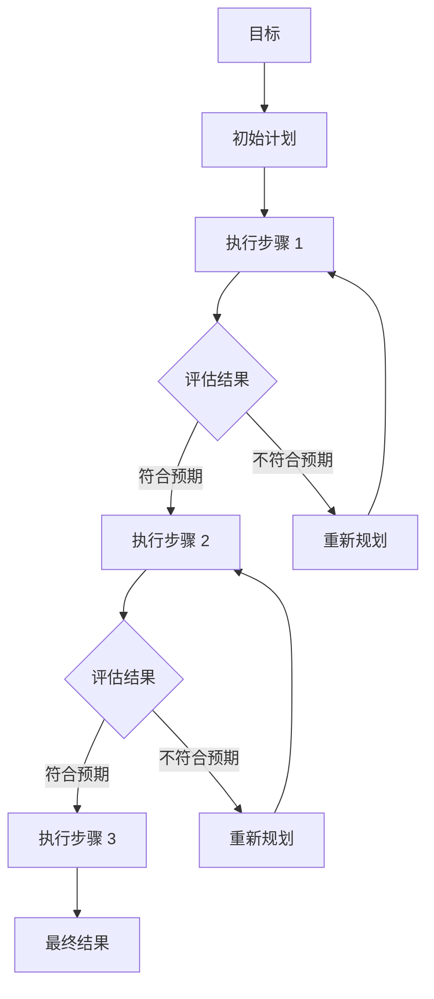

> [!quote]
>
> Planning is thinking about the actions needed to achieve a desired goal.

## 基本概念

规划 (Planning) 是 Agent 面对复杂任务时的核心能力。一个任务如果可以一步完成，则不需要规划；但当任务涉及多个步骤、多个工具调用或需要中间推理时，规划策略就变得至关重要。

规划的本质是**任务分解** (Task Decomposition)：将一个复杂的高层目标分解为一系列可执行的子任务，并确定它们之间的执行顺序和依赖关系。

## 规划范式

### 单次规划 (Plan-and-Execute)

模型在开始执行前先生成完整的计划，然后按步骤执行。

优点：全局视角，步骤之间逻辑连贯。

缺点：初始计划可能因信息不足而不准确，且难以在执行过程中修正。

### 自适应规划 (Re-planning)

在执行过程中根据中间结果动态调整计划。

优点：容错性强，能根据实际情况调整策略。

缺点：开销更大，可能导致循环。

### 递归分解 (Recursive Decomposition)

将任务递归地分解为更小的子任务，直到每个子任务可以直接执行。典型的代表是 [Tree of Thoughts (ToT)](https://arxiv.org/abs/2305.10601)。

## 常见规划方法

### Chain-of-Thought (CoT)

通过引导模型「一步一步思考」来实现隐式规划。虽然 CoT 本身不是一个显式的规划框架，但它为每一步推理提供了中间过程，可以视为最基础的规划形式。

### Plan-and-Solve

[*Plan-and-Solve Prompting*](https://arxiv.org/abs/2305.04091) 提出两步策略：

1. **Plan**：将原始任务分解为若干子任务；
2. **Solve**：逐个执行子任务并整合结果。

### Reflexion

[*Reflexion: Language Agents with Verbal Reinforcement Learning*](https://arxiv.org/abs/2303.11366) 引入了**反思**机制：

1. 执行动作并观察结果；
2. 生成语言化的反思（什么做得好、什么做得差）；
3. 将反思存入记忆，指导下一次尝试。

## 规划中的关键挑战

- **信息不完整**：初始规划时可能缺乏足够的上下文信息；
- **长程依赖**：步骤之间的依赖关系可能很复杂；
- **错误累积**：早期步骤的错误可能传播到后续步骤；
- **规划与执行的平衡**：过度规划浪费资源，规划不足导致失败。

