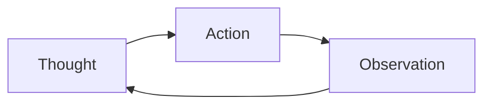

> [!quote]
>
> Reasoning enables an agent to formulate a plan, while acting enables it to interact with the environment.

## 基本概念

ReAct（**Re**asoning + **Act**ing）是一种将推理与行动交替进行的 Agent 范式，由 Yao et al. (2022) 在论文 [*ReAct: Synergizing Reasoning and Acting in Language Models*](https://arxiv.org/abs/2210.03629) 中提出。

传统 LLM 的使用方式通常是：

- **纯推理 (Reasoning-only)**：如 Chain-of-Thought (CoT)，模型仅进行内部推理，无法与外部环境交互；
- **纯行动 (Acting-only)**：如直接调用 API，模型直接输出动作，缺乏中间推理过程。

ReAct 的核心思想是将两者结合，让模型在每一步先进行**推理**（Thought），再执行**行动**（Action），观察结果后继续推理，形成循环。

## 工作流程

ReAct 的典型执行循环如下：



具体步骤：

1. **Thought**：模型分析当前状态，进行推理，决定下一步应该做什么以及为什么；
2. **Action**：根据推理结果，选择并执行一个具体的动作（如搜索、计算、调用 API 等）；
3. **Observation**：获取动作执行的结果；
4. 重复上述过程，直到模型认为已经得到足够的信息来回答原始问题。

## 示例

以一个简单的问答任务为例：

```
Question: What is the elevation range for the area that the eastern 
          sector of the Colorado orogeny extends into?

Thought 1: I need to search for the Colorado orogeny and find its eastern sector.
Action 1: Search["Colorado orogeny"]
Observation 1: The Colorado orogeny was an episode of mountain building in 
               the western United States...

Thought 2: The eastern sector extends into the High Plains. I need to find 
           the elevation range of the High Plains.
Action 2: Search["High Plains elevation range"]
Observation 2: The High Plains rise in elevation from around 1,800 ft to 
               7,000 ft...

Thought 3: The elevation range of the High Plains is 1,800 ft to 7,000 ft. 
           I can now answer the question.
Action 3: Finish["1,800 ft to 7,000 ft"]
```

## 与其他范式的对比

| 范式 | 推理 | 行动 | 特点 |
|---|---|---|---|
| Prompting | ✅ | ❌ | 纯内部推理，如 CoT |
| Acting | ❌ | ✅ | 直接输出动作，无推理过程 |
| ReAct | ✅ | ✅ | 推理与行动交替，可解释性强 |

## 关键优势

- **可解释性**：Thought 步骤使得模型的决策过程透明可审计；
- **灵活性**：可以根据 Observation 动态调整策略，而非固定流程；
- **事实性**：通过与外部工具交互获取真实信息，减少幻觉。

## 局限性

- 推理链过长时，累积错误可能导致偏离目标；
- 每一步都需要 LLM 推理，调用成本较高；
- 对于简单任务，ReAct 的开销可能过大。


