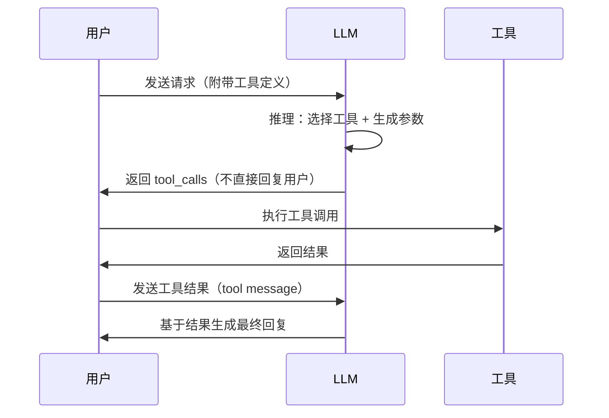

> [!quote]
>
> A language model itself can only generate text. But with tools, it can interact with the real world.

## 基本概念

工具调用 (Tool Use / Function Calling) 是让大模型突破「纯文本生成」局限的关键能力。通过定义工具的名称、描述和参数 schema，模型可以在推理过程中决定何时调用哪个工具，并生成符合 schema 的结构化调用请求。

这一能力的实现通常分为三步：

1. **工具定义**：以结构化方式（如 JSON Schema）向模型描述可用工具；
2. **工具选择**：模型根据用户需求和工具描述，推理出需要调用的工具及其参数；
3. **结果整合**：将工具返回的结果注入上下文，模型基于真实数据继续推理或生成最终回复。

## Function Calling

以 OpenAI 的 Function Calling 为例，一次典型的工具调用流程如下：



关键点：

- 模型本身**不执行**工具，而是输出结构化的调用请求，由外部系统执行；
- 一次推理可能产生**多个** tool_calls（并行调用）；
- 工具调用的结果作为新的 message 注入对话上下文。

## Tool Calling 的训练

模型获得 Tool Calling 能力通常需要经过专门的训练阶段：

### 监督微调 (SFT)

在训练数据中加入大量「需求 → 工具调用」的样本对，例如：

```json
{
  "messages": [
    {"role": "user", "content": "北京现在几点了？"},
    {"role": "assistant", "tool_calls": [
      {"type": "function", "function": {
        "name": "get_current_time",
        "arguments": "{\"timezone\": \"Asia/Shanghai\"}"
      }}
    ]},
    {"role": "tool", "content": "2026-05-14T10:30:00+08:00"},
    {"role": "assistant", "content": "现在北京时间是上午 10:30。"}
  ]
}
```

### 强化学习 (RL)

部分模型（如 Qwen2.5）通过 RLHF 进一步优化工具选择的准确性和参数生成的质量。

## Structured Output

Structured Output 是 Tool Use 的泛化形式，即使没有外部工具，也能让模型输出符合指定 JSON Schema 的结构化数据。这对于：

- 数据提取与解析
- 表单填写
- API 对接

等场景非常有用。

## 关键挑战

- **工具数量扩展**：当可用工具数量增多时，模型的选择准确率可能下降；
- **参数幻觉**：模型可能生成不存在的参数值或错误的参数类型；
- **多步工具调用**：需要模型理解工具之间的依赖关系并正确编排调用顺序；
- **错误处理**：工具调用失败时，模型需要具备重试或换用替代工具的能力。

## 主流模型支持

截至 2026 年 5 月，各主流厂商的旗舰模型均已支持 Tool Calling，且普遍新增了 Tool Search（工具搜索）能力，可在工具数量较多时按需加载相关工具定义以减少 token 消耗。

| 模型 | Function Calling | Structured Output | Parallel Tool Calls | 备注 |
|---|---|---|---|---|
| GPT-5.5 | ✅ | ✅ | ✅ | 支持 Tool Search、Computer Use |
| GPT-5.4 | ✅ | ✅ | ✅ | 1M 上下文，Tool Search，Computer Use |
| Claude Opus 4.7 | ✅ | ✅ | ✅ | 1M 上下文，Tool Search，Adaptive Thinking |
| Claude Sonnet 4.6 | ✅ | ✅ | ✅ | 1M 上下文（beta），性价比首选 |
| Gemini 3.1 Pro | ✅ | ✅ | ✅ | 1M 上下文，原生代码执行 |
| DeepSeek V4 Pro | ✅ | ✅ | ✅ | 1M 上下文，strict 模式（beta） |
| Qwen 3.6 Plus | ✅ | ✅ | ✅ | 1M 上下文，原生多模态，OpenAI 兼容 |


